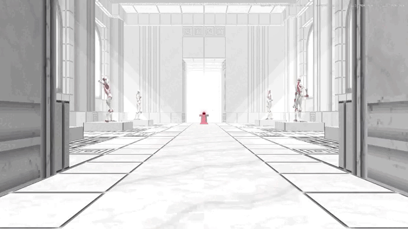

# UltraCinematic

[Русский](#русский) · [English](#english)

[Подробная русская Wiki](docs/WIKI_RU.md)

## Русский

**UltraCinematic** — мод для ULTRAKILL на BepInEx 5, предназначенный для создания плавных кинематографических пролётов штатной камерой игрока. Все инструменты встроены в стандартное меню `MANAGE CHEATS` в категорию **CINEMATIC**.



### Возможности

- создание, вставка и удаление Camera Points прямо во время игры;
- визуализация точек, направления камеры и маршрута в мире;
- Timeline с предпросмотром любого кадра;
- редактирование Position X/Y/Z, Rotation Pitch/Yaw/Roll и FOV каждой точки;
- индивидуальные `Linear`, `Bezier` и `Smooth` Path для сегментов;
- единое Flight Time для всего маршрута и автоматическое распределение времени по измеренной длине кривой;
- Soft Points с настраиваемыми окнами до и после внутренних точек;
- удаление выбранной точки, сдвиг всего маршрута по X/Y/Z и сворачиваемые панели редактора;
- вставка следующей создаваемой точки перед первой точкой или внутрь выбранного сегмента;
- воспроизведение в работающем или полностью замороженном мире;
- `Pause Game` с отдельным свободным перемещением камеры на остановленном времени;
- именованные сохранения Timeline, привязанные к конкретному уровню;
- глобальные пресеты маршрутов с размещением относительно текущей позиции игрока;
- загрузка, перезапись, удаление и безопасная очистка проектов;
- интерфейс на русском и английском языках;
- стили Timeline `Classic` и `Dark`;
- меню настроек с изменяемой папкой сохранений.
- сохранение текущих точек и Timeline после смерти или перезапуска уровня; очистка выполняется только при выходе с уровня.

### Использование

1. Включите игровые читы ULTRAKILL.
2. Откройте `MANAGE CHEATS` и найдите категорию **CINEMATIC**.
3. Включите **Cinematic Edit Mode**.
4. Перемещайте игрока обычным способом или штатным Noclip и добавляйте **Camera Points**.
5. Откройте **Timeline**, настройте точки, сегменты, общее время и параметры пролётки.
6. Проверьте маршрут с помощью ползунка или `PREVIEW POINT`.
7. Запустите **Start Cinematic**.

Edit Mode не включает Noclip, не скрывает HUD и не меняет оружие — этими штатными функциями ULTRAKILL пользователь управляет самостоятельно.

### Timeline и плавность

Точки отображаются кружками и нумеруются с 1, а сегменты обозначаются буквами начиная с A. Время отдельных сегментов рассчитывается автоматически по фактической длине кривой, поэтому базовая пространственная скорость остаётся равномерной.

Кнопки `+` со стрелками `▼` задают место для следующей создаваемой Camera Point. Кнопка перед первой точкой вставляет новую точку в начало, а кнопка над сегментом разделяет этот сегмент на два. Если место вставки не выбрано, **Add Camera Point** добавляет точку в конец маршрута. Выбранную точку можно удалить непосредственно из панели её параметров; остальные точки автоматически перенумеровываются.

Soft Points работают с любым сочетанием Path. Для внутренних точек можно задать процент сглаживания до и после точки в диапазоне 1–45%. Переход строится кривой пятой степени с непрерывными скоростью и ускорением. Первая и последняя точки всегда остаются точными.

### Режимы времени

- `LIVE WORLD` — мир продолжает работать во время пролётки.
- `FROZEN WORLD` — мир, физика, частицы и снаряды остановлены, а пролётка идёт по unscaled time.
- `Pause Game` — останавливает время и включает свободное управление: мышь, WASD, Space/Ctrl по вертикали и Shift для ускорения.

Если Timeline был открыт из активного `Pause Game`, заморозка восстанавливается после закрытия Timeline, завершения пролётки или её ручной остановки. Точки, созданные во время свободного перемещения на паузе, записываются из точного состояния камеры.

### Сохранения

Кнопки `SAVE AS`, `LOAD`, `PRESETS` и `CLEAR` находятся в верхней части Timeline. Проект сохраняет все точки, Position/Rotation/FOV, Path, Flight Time, режим времени и Soft Points.

`SAVE AS` позволяет сохранить маршрут как проект текущего уровня или как глобальный пресет. Проекты уровня нельзя загрузить на другой карте. Пресет доступен на любой карте: позиции его точек хранятся относительно камеры в момент сохранения, поэтому при загрузке маршрут появляется перед игроком в новом месте. Проекты и пресеты можно загружать, перезаписывать и удалять из соответствующих списков.

По умолчанию сейвы хранятся в:

```text
BepInEx/config/UltraCinematic/Timelines
```

Каждый проект привязан к идентификатору активного уровня. Сейвы другого уровня не отображаются и не могут быть загружены. Перед загрузкой файл полностью проверяется, и только затем текущий Timeline заменяется.

Основная часть Timeline прокручивается колесом мыши, а панели настроек сегмента, точки, перемещения всего маршрута и параметров пролётки можно сворачивать. Пока Timeline открыт, игровой ввод полностью блокируется, поэтому клики по редактору не вызывают стрельбу или другие действия игрока.

### Настройки интерфейса

Кнопка `НАСТРОЙКИ` расположена рядом с крестиком закрытия Timeline. В ней можно:

- переключить весь интерфейс UltraCinematic между русским и английским языками;
- выбрать стиль Timeline `Classic` или `Dark`;
- посмотреть текущую папку проектов;
- указать другую абсолютную папку сохранений или вернуть стандартную.

Язык, стиль и выбранный путь сохраняются между запусками игры. При смене папки существующие проекты автоматически не перемещаются.

### Сборка и установка

Требуются .NET Framework 4.7.2 Developer Pack, BepInEx 5 и установленный ULTRAKILL.

```powershell
$env:ULTRAKILL_DIR = 'C:\Program Files (x86)\Steam\steamapps\common\ULTRAKILL'
dotnet build -c Release
```

Либо передайте путь напрямую:

```powershell
dotnet build -c Release -p:GameDir="D:\Games\ULTRAKILL"
```

Скопируйте `bin/Release/net472/UltraCinematic.dll` в `ULTRAKILL/BepInEx/plugins/UltraCinematic/UltraCinematic.dll`.

---

## English

**UltraCinematic** is a BepInEx 5 mod for ULTRAKILL that creates smooth cinematic flights using the game's existing player camera. Every tool is integrated into the standard `MANAGE CHEATS` menu under the **CINEMATIC** category.

### Features

- create, insert, and remove Camera Points in game;
- visualize points, camera direction, and the complete route in world space;
- Timeline with live preview at any frame;
- edit Position X/Y/Z, Rotation Pitch/Yaw/Roll, and FOV for every point;
- independent `Linear`, `Bezier`, and `Smooth` Path modes per segment;
- one total Flight Time with automatic timing based on measured curve length;
- configurable Soft Point windows before and after internal points;
- delete the selected point, move the entire route on X/Y/Z, and collapse editor panels;
- insert the next Camera Point before Point 1 or inside a selected segment;
- playback in a live or completely frozen world;
- `Pause Game` with a separate free-camera controller on frozen time;
- named, level-specific Timeline saves;
- global route presets positioned relative to the player's current location;
- load, overwrite, delete, and safely clear projects;
- complete English and Russian interfaces;
- `Classic` and `Dark` Timeline styles;
- a settings menu with a configurable save directory.
- preservation of the current Camera Points and Timeline after death or a same-level restart; data is cleared only after leaving the level.

### Usage

1. Enable ULTRAKILL cheats.
2. Open `MANAGE CHEATS` and locate the **CINEMATIC** category.
3. Enable **Cinematic Edit Mode**.
4. Move normally or use ULTRAKILL's own Noclip and add **Camera Points**.
5. Open the **Timeline** and configure points, segments, total time, and cinematic settings.
6. Inspect the route with the Timeline cursor or `PREVIEW POINT`.
7. Run **Start Cinematic**.

Edit Mode does not enable Noclip, hide the HUD, or modify weapons. Those remain under the user's control through ULTRAKILL's standard cheats.

### Timeline and smoothing

Points are circular and numbered from 1. Segments are lettered from A. Individual segment time is derived automatically from measured curve length, keeping the base spatial speed uniform.

The `+` controls with `▼` indicators choose where the next Camera Point will be created. The control before Point 1 inserts a new first point, while a control above a segment splits that segment in two. With no insertion control selected, **Add Camera Point** appends to the end of the route. The selected point can be deleted from its settings panel, and all remaining points are renumbered automatically.

Soft Points work with every Path combination. Internal points expose independent 1–45% smoothing windows before and after the point. A quintic transition maintains continuous velocity and acceleration, while the first and last points always remain exact.

### Time modes

- `LIVE WORLD` keeps the world running during playback.
- `FROZEN WORLD` freezes gameplay, physics, particles, and projectiles while playback advances on unscaled time.
- `Pause Game` freezes time and enables free movement with mouse, WASD, Space/Ctrl vertically, and Shift for higher speed.

When the Timeline is opened from an active `Pause Game`, the frozen state is restored after closing the Timeline, finishing playback, or stopping it manually. Camera Points created while moving in Pause Game use the free camera's exact state.

### Saves

The Timeline header contains `SAVE AS`, `LOAD`, `PRESETS`, and `CLEAR`. A project stores all points, Position/Rotation/FOV values, Path modes, Flight Time, time mode, and Soft Point settings.

`SAVE AS` can create either a project for the current level or a global preset. Level projects cannot be loaded on another map. A preset is available everywhere: its points are stored relative to the camera at save time, so loading places the route in front of the player at the new location. Projects and presets can be loaded, overwritten, or deleted from their respective lists.

By default, save files are stored under:

```text
BepInEx/config/UltraCinematic/Timelines
```

Each project is bound to the active level identity. Saves from another level are neither listed nor loadable. A file is fully validated before it can replace the current in-memory Timeline.

The main Timeline content is mouse-wheel scrollable. Segment, point, Move All, and cinematic settings panels can be collapsed. Gameplay input is fully captured while the Timeline is open, preventing editor clicks from firing weapons or triggering other player actions.

### Interface settings

The `SETTINGS` button is located next to the Timeline close icon. It can be used to:

- switch the entire UltraCinematic interface between English and Russian;
- select the `Classic` or `Dark` Timeline style;
- inspect the current project directory;
- set another absolute save directory or restore the default.

Language, style, and the selected path persist across game restarts. Existing projects are not moved automatically when the directory changes.

### Build and installation

.NET Framework 4.7.2 Developer Pack, BepInEx 5, and an installed copy of ULTRAKILL are required.

```powershell
$env:ULTRAKILL_DIR = 'C:\Program Files (x86)\Steam\steamapps\common\ULTRAKILL'
dotnet build -c Release
```

Alternatively, provide the game directory directly:

```powershell
dotnet build -c Release -p:GameDir="D:\Games\ULTRAKILL"
```

Copy `bin/Release/net472/UltraCinematic.dll` to `ULTRAKILL/BepInEx/plugins/UltraCinematic/UltraCinematic.dll`.
